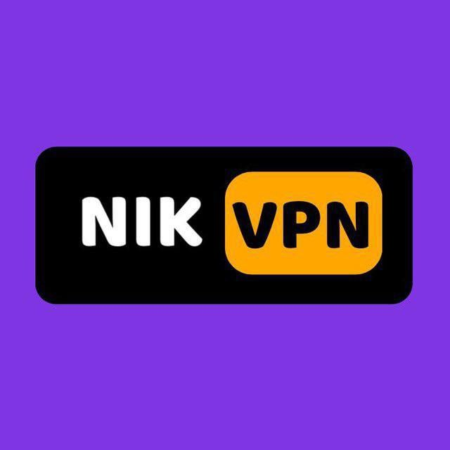

<div align="center">



# N-MAP

**nikvpn multi api panel**

پنل مدیریت روی Cloudflare Workers — بدون سرور، بدون هزینه، با پشتیبانی از چند اکانت API

[](LICENSE)
[](https://workers.cloudflare.com)
[](https://developers.cloudflare.com/d1)

</div>

---

## معرفی

N-MAP یک پنل مدیریت تک‌فایلی است که کاملاً روی زیرساخت رایگان **Cloudflare Workers** و دیتابیس **D1** اجرا می‌شود. نیازی به سرور، VPS یا نصب هیچ نرم‌افزاری ندارید — کل پنل با یک کلیک روی اکانت کلودفلر خودتان مستقر (deploy) می‌شود.

## امکانات

- استقرار **یک‌کلیکی** روی اکانت Cloudflare خودتان — بدون سرور و بدون هزینه
- مدیریت **چند اکانت API** از پلتفرم‌های مختلف (Cloudflare و Vercel)
- دریافت توکن **با یک کلیک** — پرمیشن‌ها از قبل آماده‌اند
- **اعتبارسنجی خودکار** توکن قبل از ذخیره
- معماری **اصلی/ثانویه** — اکانت اول برای زیرساخت، بقیه برای ریکوئست رایگان روزانه
- مدیریت **کاربران** با کنترل ترافیک، انقضا و آمار لحظه‌ای
- مدیریت **لینک‌های ساب** و پروکسی (مخزن آیپی تمیز و پروکسی چند کشور)
- **آپدیت خودکار** پنل از داخل خود پنل
- **پشتیبان‌گیری و بازیابی** کاربران
- رابط کاربری **فارسی RTL** — تم تیره (AMOLED)، ریسپانسیو

## نحوه استقرار (Deploy)

استقرار از طریق **دیپلویر** (`n-map-deployer.js`) انجام می‌شود که خودش Worker و دیتابیس D1 را می‌سازد و لینک نهایی پنل را به شما می‌دهد.

### گام ۱ — ساخت Worker دیپلویر

۱. وارد داشبورد Cloudflare شوید → **Workers & Pages** → **Create Worker**

۲. یک نام دلخواه بگذارید و Worker را بسازید، سپس **Edit code** را بزنید

۳. محتوای فایل [`n-map-deployer.js`](n-map-deployer.js) را کپی کنید و به‌جای کد پیش‌فرض بگذارید

۴. **Deploy** را بزنید و روی لینک `*.workers.dev` دیپلویر کلیک کنید

### گام ۲ — استقرار پنل

۱. در صفحه دیپلویر روی دکمه نارنجی **«دریافت توکن»** بزنید — به صفحه ساخت توکن کلودفلر با پرمیشن‌های آماده هدایت می‌شوید

۲. توکن را بسازید، کپی کنید و در دیپلویر paste کنید

۳. دکمه **Deploy** را بزنید — دیپلویر به‌صورت خودکار:
   - دیتابیس D1 می‌سازد
   - آخرین نسخه پنل را از گیت‌هاب می‌گیرد
   - Worker پنل را مستقر و به دیتابیس متصل می‌کند

۴. لینک نهایی پنل به‌شکل `https://n-map-panel-xxxx.your-sub.workers.dev/panel` به شما داده می‌شود

> **توجه امنیتی:** توکنی که در گام بالا می‌سازید به‌عنوان secret روی Worker شما ذخیره می‌شود و فقط در اکانت خودتان می‌ماند.

### گام ۳ — اولین ورود

۱. لینک `/panel` را باز کنید — در اولین ورود از شما خواسته می‌شود **رمز عبور مدیریت** تعیین کنید

۲. رمز را تعیین کنید و وارد پنل شوید

## نحوه افزودن اکانت API

پنل به شما اجازه می‌دهد چند اکانت API را همزمان مدیریت کنید:

۱. در نوار ابزار بالای پنل روی آیکون **«اکانت‌های API»** کلیک کنید

۲. پلتفرم (**Cloudflare** یا **Vercel**) را انتخاب کنید

۳. روی دکمه نارنجی **«دریافت توکن»** بزنید — به صفحه ساخت توکن با پرمیشن‌های آماده هدایت می‌شوید

۴. یک نام دلخواه بگذارید و توکن را paste کنید

۵. روی **«اعتبارسنجی و ثبت اکانت»** بزنید — توکن قبل از ذخیره به‌صورت خودکار اعتبارسنجی می‌شود

> اولین اکانت به‌طور خودکار **«اصلی»** می‌شود و برای زیرساخت استفاده می‌شود. اکانت‌های بعدی **«ثانویه»** هستند و فقط از ریکوئست رایگان روزانه پلتفرم بهره می‌برند. با دکمه **«اصلی کن»** می‌توانید هر زمان اکانت اصلی را عوض کنید.

## توسعه محلی (اختیاری)

برای تست و توسعه محلی به [Wrangler](https://developers.cloudflare.com/workers/wrangler/) نیاز دارید:

```bash
git clone https://github.com/nikvpn-iran/n-map.git
cd n-map
npx wrangler dev n-map.js --local --port 8787
```

پنل روی `http://127.0.0.1:8787/panel` اجرا می‌شود. در حالت `--local` دیتابیس D1 به‌صورت محلی شبیه‌سازی می‌شود.

## API

| متد | مسیر | عملکرد |
|-----|------|--------|
| `POST` | `/api/setup-password` | تعیین رمز در اولین ورود |
| `POST` | `/api/login` | ورود |
| `POST` | `/api/logout` | خروج |
| `GET` `POST` | `/api/accounts` | لیست / افزودن اکانت API |
| `PUT` `DELETE` | `/api/accounts/:id` | تنظیم اصلی / حذف اکانت |
| `POST` | `/api/accounts/verify` | اعتبارسنجی توکن |
| `GET` `POST` `PUT` `DELETE` | `/api/users` | مدیریت کاربران |
| `POST` | `/api/change-password` | تغییر رمز مدیریت |
| `POST` | `/api/update-panel` | آپدیت خودکار پنل |
| `GET` | `/sub/:id` `/feed/:id` | لینک ساب کاربر |

## تکنولوژی‌ها

Cloudflare Workers &bull; D1 (SQLite) &bull; JavaScript (ES Modules) &bull; Tailwind CSS (CDN) &bull; WebSocket

## ساختار پروژه

| فایل | نقش |
|------|------|
| `n-map.js` | Worker اصلی — پنل، API، دیتابیس و پروکسی (تک‌فایلی) |
| `n-map-deployer.js` | دیپلویر یک‌کلیکی — ساخت Worker و D1 |
| `wrangler.toml` | تنظیمات Worker برای اجرای محلی |
| `proxy/` | مخزن پروکسی به تفکیک کشور |
| `ips.txt` | مخزن آیپی تمیز کلودفلر |

## مشارکت

از Pull Request استقبال می‌کنیم. Fork کنید، برنچ بسازید، تغییرات را Push کنید.

## لایسنس

[MIT](LICENSE)

---

<div align="center">

ساخته شده توسط [NikVPN](https://github.com/nikvpn-iran) &bull; [کانال تلگرام](https://t.me/nikvpn)

</div>
